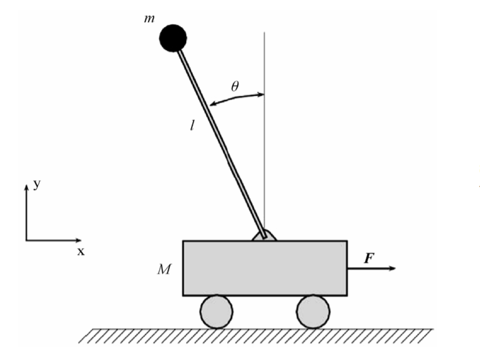
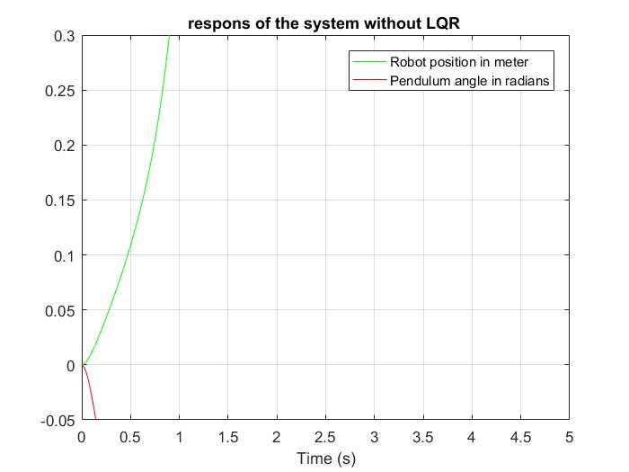
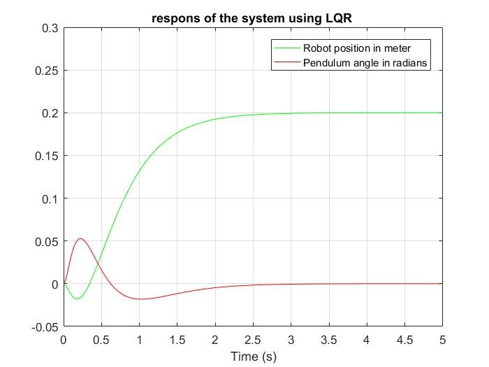
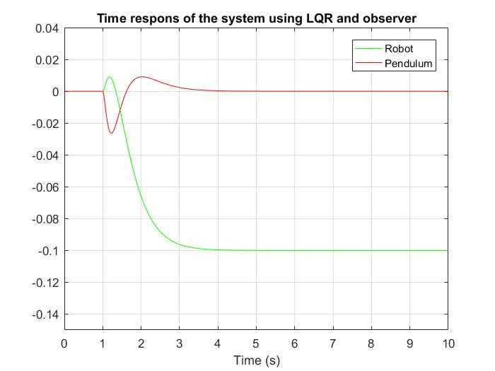

---

 # **an Inverted Pendulum with a LQR and an Observer**

---

In Sec.1 we should define the state-space matrix and after that define system.

 

Fig.1 – The model of Inverted Pendulum

 

---

 

Fig.2 – The Simulation without Controller

 

In Sec.2 controllability and observability are checked.

In Sec.3 we want to simulate a closed-loop system with LQR.

In Sec.4 figure!

 

Fig.3 – The Simulation with LQR

 

In Sec.5 adding an observer and simulate again

In Sec.6 figure!

 

Fig.1 – The Finall Simulation

 
